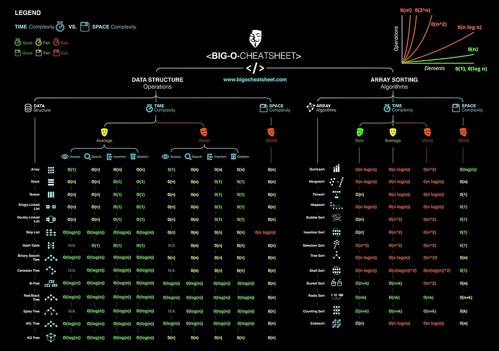

# 《数据结构与算法之美 - 王争》

数据结构和算法是相辅相成的。数据结构是为算法服务的，算法要作用在特定的数据结构之上。

## 复杂度分析

### 分类

- 时间复杂度(asymptotic time complexity)

    代码的执行时间随数据规模增长的变化趋势

- 空间复杂度(asymptotic space complexity)

    代码的存储空间随数据规模增长的变化趋势

### 量级

- 多项式
    - $O(1)$
    - $O(n)$
    - $O(\log(n))$
    - $O(n\log(n))$
    - $O(n^2)、O(n^3) ... O(n^k)$
- 非多项式
    - $O(2^n)$
    - $O(n!)$
    
### 情况

- 最好情况时间复杂度(best case time complexity)
- 最坏情况时间复杂度(worst case time complexity)
- 平均情况时间复杂度(average case time complexity)
- 均摊时间复杂度(amortized time complexity)

## 线性表(Linear List)

### 数组(Array)

用一组连续的内存空间，来存储一组具有相同类型的数据

- 随机访问和更新 O(1)
- 搜索、插入、删除 O(n)

### 链表(Linked List)

- 单向链表、循环链表
- 双向链表（空间换时间）、双向循环链表

常见缓存淘汰策略：

- 先进先出策略 FIFO(First In， First Out)
- 最少使用策略 LFU(Least Frequently Used)
- 最近最少使用策略 LRU(Least Recently Used)

### 栈(Stack)

先进后出，后进先出的数据结构

### 队列(Queue)

先进先出的数据结构

## 递归(Recursion)

- 一个问题的解可以分解为几个子问题的解
- 这个问题与分解之后的子问题，除了数据规模不同，求解思路完全一样
- 存在终止条件

问题：堆栈溢出、重复计算、函数调用耗时多、空间复杂度高

## Reference

- [数据结构与算法之美 - 为工程师量身打造的数据结构与算法私教课](https://time.geekbang.org/column/intro/126)
- [数据结构与算法之美 - Github](https://github.com/wangzheng0822/algo)